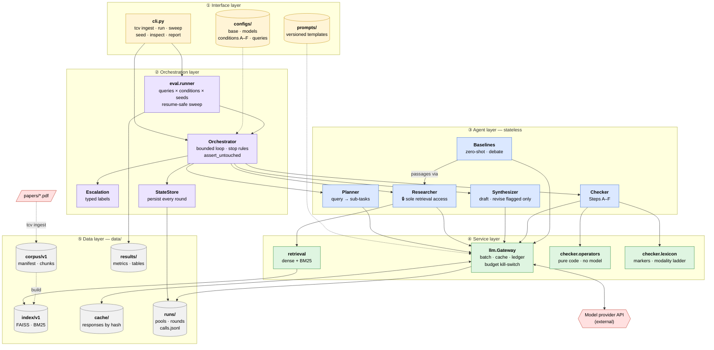
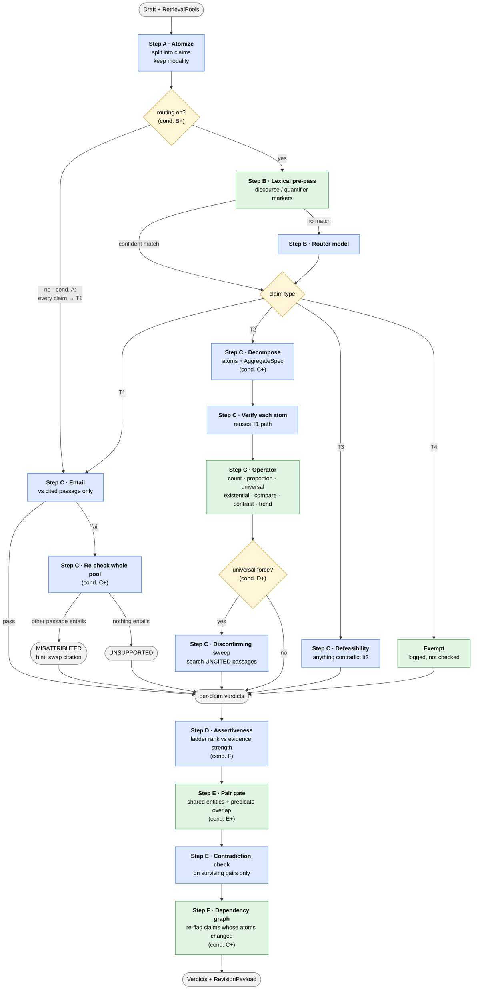
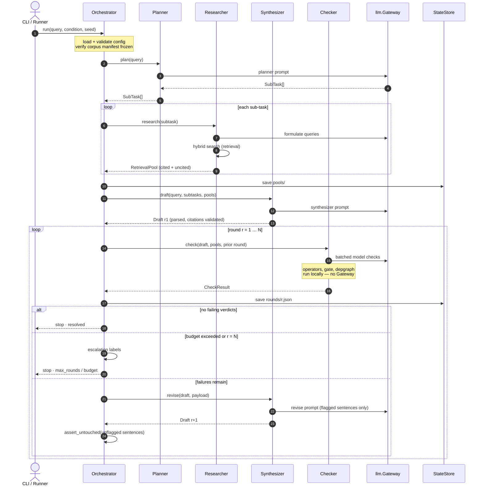
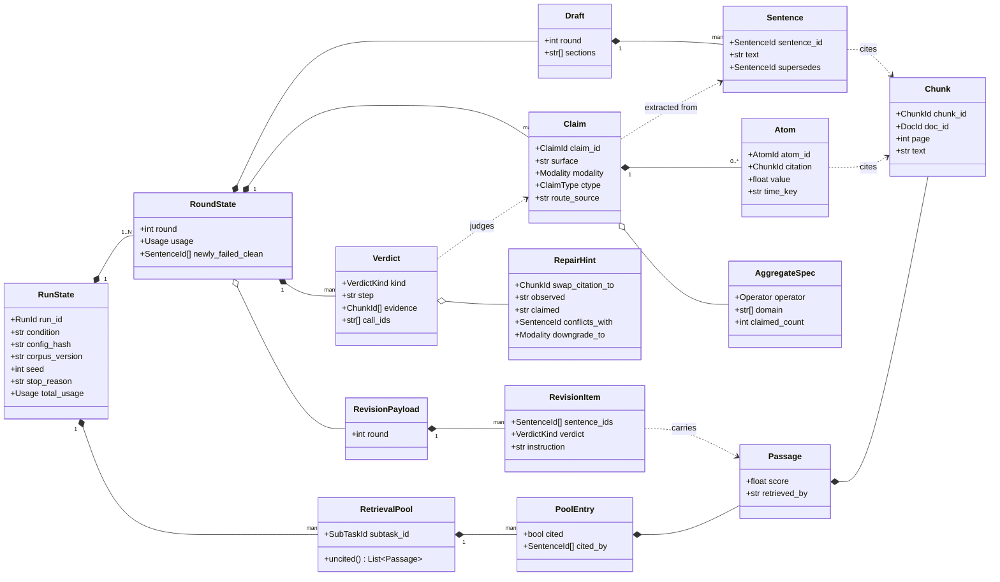
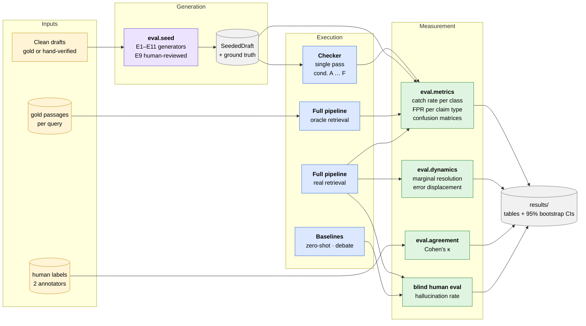

# Architecture — Type-Routed Claim Verification

**Companion to** `updated_proposal.md` (what and why), `requirements.md` (what must exist), `roadmap.md` (when). This document specifies **how it is built**: repo layout, data structures, component contracts, storage, and configuration.

**Status:** Design — nothing implemented yet. Schemas in §4 are frozen at the end of Phase 1; changes after that require updating this document first.

**Naming.** Internal identifiers match `requirements.md`: novelties N1–N11, error classes E1–E11, claim types T1–T4, ablation conditions A–F. The MSE report uses plain numbering for the same things (condition A = Version 1, … F = Version 6).

---

# 1. Architectural Invariants

These are properties the structure must *enforce*, not conventions people are asked to follow. Each names how it is enforced.

| # | Invariant | Enforced by |
|---|---|---|
| **I-1** | Only the Researcher touches the retriever | `retrieval` is imported only by `agents/researcher.py`; an import-linter contract fails CI otherwise (§3.2) |
| **I-2** | The retrieval pool keeps uncited passages | `RetrievalPool` has no delete/prune method; `cited` is a flag, never a filter (§4.3) |
| **I-3** | Composition operators contain no model calls | `checker/operators/` may not import `llm`; enforced by the same import contract |
| **I-4** | Every model call goes through one gateway | `llm.Gateway` is the only module importing the provider SDK; it logs, caches, batches, and enforces budget (§7) |
| **I-5** | Components exchange validated objects, never dicts | All boundary types are Pydantic models with `extra="forbid"` (§4) |
| **I-6** | A run is replayable offline | Every round's full state is persisted; the response cache is keyed by prompt hash (§8) |
| **I-7** | Ablation conditions differ only by config | The Checker reads feature flags from `CheckerConfig`; no `if condition == "C"` anywhere (§9) |
| **I-8** | Prompts are files, not string literals | Loaded from `prompts/` by name + version; the version is recorded in every call log |
| **I-9** | Model IDs are pinned | Config validation rejects any model ID without an explicit version (§9.1) |

---

# 2. System Architecture

Five diagrams, each answering one question:

| § | Diagram | Answers |
|---|---|---|
| 2.1 | Layered component architecture | What are the parts, and who may talk to whom? |
| 2.2 | Checker internal pipeline | What happens to one draft inside the Checker? |
| 2.3 | Runtime sequence | In what order do things happen during one run? |
| 2.4 | Data model | How do the core structures relate? |
| 2.5 | Evaluation architecture | How are results produced from runs? |

> **Rendering.** Diagrams are Mermaid. They render natively on GitHub and GitLab, and in VS Code with the *Markdown Preview Mermaid Support* extension. Pre-rendered SVG and PNG copies are in `diagrams/`; regenerate them after editing a diagram.
>
> **Naming trap.** The Checker has **steps A–F** and the experiment has **conditions A–F**. They are different things. Diagrams always write *Step D* or *cond. F* in full.

## 2.1 Layered Component Architecture



**Figure 2.1:** Layers only call downward. Arrows show allowed dependencies, and the three structural invariants are visible directly in the diagram:

- Only **Researcher → retrieval** exists (**I-1**). Baselines get passages *through* the Researcher, so every system sees identical evidence.
- **checker.operators** has no arrow to the Gateway (**I-3**). The counting is code.
- Every model call funnels through **llm.Gateway** (**I-4**), which is why caching, logging, batching, and the budget kill-switch are implemented exactly once.

## 2.2 Checker Internal Pipeline



**Figure 2.2:** 🟦 **blue = model call**, 🟩 **green = plain code**, 🟨 **yellow = branch on config or type.** Each branch labelled *cond. X+* is switched on from that ablation condition onward (§9.2).

The two green boxes in the middle carry the thesis: the **Operator** does the aggregation in code, and the **Pair gate** keeps Step E affordable. Condition A takes the left-most path for every claim, which is exactly the "standard single-passage checking" baseline.

## 2.3 Runtime Sequence — One Run



**Figure 2.3:** The Orchestrator is the only participant holding state across steps. `assert_untouched` after every revision is what makes error displacement (N11) measurable: a sentence the payload did not name must come back byte-identical, so any new failure on it is genuinely revision-induced.

## 2.4 Data Model



**Figure 2.4:** Solid diamonds are ownership (persisted inside the parent); dashed arrows are references by ID. Full definitions with validation are in §4. Note that `RetrievalPool` has only a read method, `uncited()`: there is no way to remove an entry (**I-2**).

## 2.5 Evaluation Architecture



**Figure 2.5:** The four experiment families and where each result comes from:

- **Seeded errors** go through a *single Checker pass*, isolating Checker quality from revision behaviour.
- **Oracle vs. real retrieval** separates Checker error from search error (N9).
- **Full-loop runs** produce loop dynamics (N11).
- **Baselines plus blind human evaluation** produce the end-to-end comparison.

---

# 3. Repository Layout

## 3.1 Directory tree

```
code-work/
├── pyproject.toml              # deps, tool config, import-linter contracts
├── uv.lock                     # pinned lockfile (MR-15)
├── .env.example                # ANTHROPIC_API_KEY=… ; real .env is git-ignored
├── README.md
│
├── docs/                       # proposal, requirements, roadmap, this file
├── papers/                     # source PDFs — git-ignored, fetched by script
├── checklist.md                # current phase (roadmap P-1)
├── checklists/                 # archived phase checklists
│
├── configs/
│   ├── base.yaml               # shared defaults
│   ├── models.yaml             # pinned model IDs per role (I-9)
│   ├── conditions/             # one file per ablation condition (I-7)
│   │   ├── A_baseline.yaml
│   │   ├── B_router.yaml
│   │   ├── C_composition.yaml
│   │   ├── D_sweep.yaml
│   │   ├── E_consistency.yaml
│   │   └── F_assertiveness.yaml
│   └── queries.yaml            # the 8–12 synthesis queries (DR-4)
│
├── prompts/                    # versioned prompt templates (I-8)
│   ├── planner/v1.md
│   ├── synthesizer/{draft,revise}/v1.md
│   ├── checker/{atomize,route,entail,decompose,defeasible,
│   │            evidence_strength,contradict}/v1.md
│   └── baselines/{zeroshot,debate}/v1.md
│
├── src/tcv/                    # "type-routed claim verification"
│   ├── schemas/                # §4 — every boundary type lives here
│   │   ├── corpus.py           #   Document, Chunk, CorpusManifest
│   │   ├── retrieval.py        #   Passage, RetrievalPool, SubTask
│   │   ├── draft.py            #   Draft, Sentence, Citation
│   │   ├── claims.py           #   Claim, ClaimType, Modality, Atom, AggregateSpec
│   │   ├── verdicts.py         #   Verdict, VerdictKind, RepairHint
│   │   ├── payload.py          #   RevisionPayload, RevisionItem
│   │   ├── run.py              #   RoundState, RunState, RunResult
│   │   └── eval.py             #   SeededError, ErrorClass, GoldLabel
│   │
│   ├── corpus/                 # ingestion (FR-1.1, 1.2, 1.6)
│   │   ├── ingest.py           #   PDF → text with page mapping
│   │   ├── chunk.py            #   text → Chunk with stable IDs
│   │   └── manifest.py         #   hashing, freeze, verify
│   │
│   ├── retrieval/              # ONLY imported by agents/researcher.py (I-1)
│   │   ├── embed.py            #   local sentence-transformer
│   │   ├── index.py            #   dense + BM25 index, build/load
│   │   └── search.py           #   hybrid search → list[Passage]
│   │
│   ├── llm/                    # ONLY module importing the provider SDK (I-4)
│   │   ├── gateway.py          #   Gateway: call(), call_batch(), budget
│   │   ├── cache.py            #   disk cache keyed by (model, prompt_hash)
│   │   ├── batching.py         #   pack N items/request, unpack structured output
│   │   ├── prompts.py          #   load template by (name, version)
│   │   └── ledger.py           #   per-call JSONL log + running cost (MR-18)
│   │
│   ├── agents/
│   │   ├── planner.py
│   │   ├── researcher.py
│   │   └── synthesizer.py
│   │
│   ├── checker/
│   │   ├── pipeline.py         #   runs steps A–F in order per CheckerConfig
│   │   ├── atomize.py          #   Step A   [model]
│   │   ├── router.py           #   Step B   [lexical pre-pass + model]
│   │   ├── lexicon.py          #   discourse markers, quantifiers, modality ladder [code]
│   │   ├── verify_t1.py        #   Step C/T1 + misattribution  [model]
│   │   ├── verify_t2.py        #   Step C/T2 decomposition + atoms [model] → operators [code]
│   │   ├── sweep.py            #   Step C/T2 disconfirming sweep [model]
│   │   ├── verify_t3.py        #   Step C/T3 defeasibility [model]
│   │   ├── assertiveness.py    #   Step D   [lexicon code + model]
│   │   ├── consistency.py      #   Step E   [gating code + model]
│   │   ├── depgraph.py         #   Step F   [code]
│   │   └── operators/          #   PURE FUNCTIONS, no llm import (I-3)
│   │       ├── count.py
│   │       ├── quantifier.py   #     universal, existential, proportion
│   │       ├── compare.py      #     comparison, contrast
│   │       └── trend.py
│   │
│   ├── orchestrator/
│   │   ├── loop.py             #   bounded Synthesizer↔Checker loop (FR-11)
│   │   ├── escalation.py       #   final typed labels
│   │   └── state.py            #   persist/load RoundState (I-6)
│   │
│   ├── eval/
│   │   ├── seed.py             #   seeded-error generators E1–E11
│   │   ├── metrics.py          #   catch rate, FPR, confusion matrices, CIs
│   │   ├── oracle.py           #   gold-passage injection (N9)
│   │   ├── dynamics.py         #   marginal resolution, displacement (N11)
│   │   ├── agreement.py        #   Cohen's kappa (N10)
│   │   └── runner.py           #   sweep: queries × conditions × seeds
│   │
│   ├── baselines/
│   │   ├── zeroshot.py
│   │   └── debate.py           #   Du et al. adapted
│   │
│   ├── inspect/                #   static HTML viewer (FR-13)
│   │   ├── render.py
│   │   └── template.html
│   │
│   └── cli.py                  #   `tcv ingest | run | sweep | seed | inspect | report`
│
├── tests/
│   ├── unit/
│   │   ├── test_operators.py   #   exhaustive — these are the N2 evidence
│   │   ├── test_lexicon.py
│   │   ├── test_depgraph.py
│   │   └── test_schemas.py
│   ├── contract/
│   │   └── test_import_rules.py
│   └── integration/
│       └── test_condition_A_smoke.py
│
├── data/                       # git-ignored; see §8
└── report/
```

## 3.2 Dependency rules

Arrows mean "may import". Anything not listed is forbidden and checked by `import-linter` in CI.

```
schemas      ◄── everything          (schemas imports nothing internal)
llm          ◄── agents, checker (not checker.operators), eval, baselines
retrieval    ◄── agents.researcher   ONLY                              (I-1)
corpus       ◄── retrieval, cli
checker.operators ◄── checker.verify_t2   and imports ONLY schemas      (I-3)
agents, checker ◄── orchestrator
orchestrator ◄── eval.runner, cli
```

```toml
# pyproject.toml
[tool.importlinter]
root_package = "tcv"

[[tool.importlinter.contracts]]
name = "Only the Researcher may touch retrieval"
type = "forbidden"
source_modules = ["tcv.agents.planner", "tcv.agents.synthesizer",
                  "tcv.checker", "tcv.orchestrator", "tcv.eval", "tcv.baselines"]
forbidden_modules = ["tcv.retrieval"]

[[tool.importlinter.contracts]]
name = "Composition operators are pure"
type = "forbidden"
source_modules = ["tcv.checker.operators"]
forbidden_modules = ["tcv.llm", "tcv.retrieval", "anthropic"]

[[tool.importlinter.contracts]]
name = "Only the gateway touches the provider SDK"
type = "forbidden"
source_modules = ["tcv.agents", "tcv.checker", "tcv.orchestrator", "tcv.eval"]
forbidden_modules = ["anthropic"]
```

> **Baseline exception.** `baselines/zeroshot.py` needs retrieval too. It gets passages from the Researcher, not from `retrieval` directly — so baselines and the main system see identical evidence, which is what makes the comparison fair.

---

# 4. Core Data Structures

All boundary types are Pydantic v2 models. Shared config:

```python
# src/tcv/schemas/_base.py
from pydantic import BaseModel, ConfigDict

class Schema(BaseModel):
    model_config = ConfigDict(
        extra="forbid",        # unknown fields are a bug, not data (I-5)
        frozen=True,           # boundary objects are immutable
        validate_assignment=True,
    )
```

Every type below carries **Full-scope fields from day one** (modality, dependency edges, consistency links), even though Core scope doesn't populate all of them. Adding a field to a schema three tracks build against is the most expensive change available (`requirements.md` §9).

## 4.1 Identifiers

Stable string IDs, never positional integers — IDs must survive re-ingestion and re-ordering.

```python
# src/tcv/schemas/ids.py
from typing import Annotated
from pydantic import StringConstraints

DocId      = Annotated[str, StringConstraints(pattern=r"^arxiv:\d{4}\.\d{4,5}v\d+$")]
ChunkId    = Annotated[str, StringConstraints(pattern=r"^arxiv:\d{4}\.\d{4,5}v\d+#p\d+c\d+$")]
SubTaskId  = Annotated[str, StringConstraints(pattern=r"^st\d{2}$")]
SentenceId = Annotated[str, StringConstraints(pattern=r"^r\d+s\d{4}$")]     # round, sentence
ClaimId    = Annotated[str, StringConstraints(pattern=r"^r\d+c\d{4}$")]
AtomId     = Annotated[str, StringConstraints(pattern=r"^r\d+c\d{4}a\d{2}$")]
RunId      = Annotated[str, StringConstraints(pattern=r"^run_[0-9a-f]{12}$")]
```

`ChunkId` embeds its document and page (`arxiv:2603.01234v2#p7c3` = doc, page 7, chunk 3), so a citation is human-readable in logs without a lookup.

> `SentenceId` embeds the round only for *creation*. FR-4.4 requires indices stable across rounds: an unrevised sentence **keeps its original ID** in later rounds. Only rewritten sentences get new IDs, and `Sentence.supersedes` links them back.

## 4.2 Corpus

```python
# src/tcv/schemas/corpus.py
from datetime import datetime

class Document(Schema):
    doc_id: DocId
    title: str
    arxiv_version: int
    sha256: str                         # of the source PDF (FR-1.6)
    n_pages: int
    ingested_at: datetime

class Chunk(Schema):
    chunk_id: ChunkId
    doc_id: DocId
    page: int                           # 1-indexed
    char_start: int                     # offset within the page text
    char_end: int
    text: str

class CorpusManifest(Schema):
    version: str                        # "v1" — bump invalidates prior runs (DR-2)
    frozen: bool
    documents: tuple[Document, ...]
    chunker: str                        # "recursive-512/64" — config that produced chunks
    embed_model: str                    # pinned local model name
```

## 4.3 Retrieval

```python
# src/tcv/schemas/retrieval.py

class SubTask(Schema):
    subtask_id: SubTaskId
    heading: str                        # report section this feeds
    question: str
    order: int

class Passage(Schema):
    chunk: Chunk
    score: float                        # retrieval score, for analysis only
    retrieved_by: str                   # the query string that found it

class PoolEntry(Schema):
    passage: Passage
    cited: bool = False                 # flag — never a filter (I-2)
    cited_by: tuple[SentenceId, ...] = ()

class RetrievalPool(Schema):
    """Everything the Researcher found for one sub-task, cited or not.

    N3 (sweep) reads the uncited entries. N6 (misattribution) reads all of them.
    There is deliberately no method that removes entries (I-2).
    """
    subtask_id: SubTaskId
    entries: tuple[PoolEntry, ...]

    def uncited(self) -> list[Passage]:
        return [e.passage for e in self.entries if not e.cited]

    def get(self, chunk_id: ChunkId) -> Passage | None: ...
```

## 4.4 Draft

```python
# src/tcv/schemas/draft.py

class Citation(Schema):
    chunk_id: ChunkId

class Sentence(Schema):
    sentence_id: SentenceId
    section: str
    text: str
    citations: tuple[Citation, ...]
    supersedes: SentenceId | None = None    # set when this is a revision

class Draft(Schema):
    round: int
    sections: tuple[str, ...]               # ordered headings
    sentences: tuple[Sentence, ...]

    def by_id(self, sid: SentenceId) -> Sentence: ...
```

Citation format in model output is `[[arxiv:2603.01234v2#p7c3]]`. The Synthesizer's output is parsed into `Sentence` objects before anything else sees it; an uncited factual sentence is rejected at parse time (FR-4.2).

## 4.5 Claims

```python
# src/tcv/schemas/claims.py
from enum import StrEnum

class ClaimType(StrEnum):
    T1_DIRECT      = "T1"
    T2_AGGREGATIVE = "T2"
    T3_INFERENTIAL = "T3"
    T4_DISCOURSE   = "T4"

class Modality(StrEnum):
    """Epistemic strength of the claim's wording (FR-5.2, FR-8.1).
    Ordered: comparison operators follow ladder order."""
    NONE         = "none"          # no modal marker; bare assertion
    SUGGESTS     = "suggests"
    INDICATES    = "indicates"
    SHOWS        = "shows"
    DEMONSTRATES = "demonstrates"
    PROVES       = "proves"

    @property
    def rank(self) -> int: ...      # suggests=1 … proves=5; none=3 (plain assertion ≈ "shows")

class Operator(StrEnum):
    """Aggregation operators for T2 claims (FR-7.5)."""
    COUNT       = "count"          # "three of five X do Y"
    PROPORTION  = "proportion"     # "most X do Y"
    UNIVERSAL   = "universal"      # "all X do Y", "consistently", "never"
    EXISTENTIAL = "existential"    # "at least one X does Y"
    COMPARISON  = "comparison"     # "X outperforms Y"
    CONTRAST    = "contrast"       # "unlike X, Y does Z"
    TREND       = "trend"          # "from 2023 to 2026, X increased"
    UNSUPPORTED = "unsupported"    # detected aggregative, operator not recognised

class Atom(Schema):
    """One constituent fact of a T2 claim."""
    atom_id: AtomId
    subject: str                   # "GSAR"
    predicate: str                 # "bounds its correction loop"
    text: str                      # "GSAR bounds its correction loop"
    citation: ChunkId | None       # passage assigned during decomposition
    value: float | None = None     # for COMPARISON / TREND: the measured number
    time_key: str | None = None    # for TREND: "2023", "2024-Q2", …

class AggregateSpec(Schema):
    """What the T2 claim asserts about its atoms — the thing the operator checks."""
    operator: Operator
    domain: tuple[str, ...]        # the population: ("GSAR","MARCH","Tool-MAD",…)
    claimed_count: int | None = None        # COUNT
    claimed_proportion: str | None = None   # PROPORTION: "most", "few", "half"
    polarity: bool = True                    # UNIVERSAL: all-true vs none-true
    direction: str | None = None            # COMPARISON/TREND: "gt","lt","increasing","decreasing"
    contrast_subject: str | None = None     # CONTRAST: the X in "unlike X"

class Claim(Schema):
    claim_id: ClaimId
    sentence_id: SentenceId
    text: str                      # normalised proposition
    surface: str                   # original wording, modality intact
    modality: Modality             # retained, never stripped (FR-5.2)
    citations: tuple[ChunkId, ...]
    ctype: ClaimType | None = None           # set by router (Step B)
    route_confidence: float | None = None
    route_source: str | None = None          # "lexical" | "model"
    atoms: tuple[Atom, ...] = ()             # set by T2 decomposition
    aggregate: AggregateSpec | None = None   # set by T2 decomposition
```

## 4.6 Verdicts

```python
# src/tcv/schemas/verdicts.py

class VerdictKind(StrEnum):
    SUPPORTED              = "supported"
    CONTRADICTED           = "contradicted"
    UNSUPPORTED            = "unsupported"
    MISATTRIBUTED          = "misattributed"            # N6
    PARTIALLY_SUPPORTED    = "partially_supported"      # N2: atoms ok, aggregate fails
    COUNTEREXAMPLE_FOUND   = "counterexample_found"     # N3
    INTERNALLY_INCONSISTENT = "internally_inconsistent" # N4
    OVERCLAIM              = "overclaim"                # N5
    INFERENCE_RETAINED     = "inference_retained"       # T3 survived
    EXEMPT                 = "exempt"                   # T4
    UNCERTAIN              = "uncertain"                # abstention (FR-7.9)
    ERROR                  = "error"                    # call failed (NFR-4.1)

class RepairHint(Schema):
    """Machine-readable instruction for the Synthesizer. Exactly one field set."""
    swap_citation_to: ChunkId | None = None            # MISATTRIBUTED
    observed: str | None = None                        # PARTIALLY_SUPPORTED: "2"
    claimed: str | None = None                         #                      "3"
    counterexample: ChunkId | None = None              # COUNTEREXAMPLE_FOUND
    conflicts_with: SentenceId | None = None           # INTERNALLY_INCONSISTENT
    downgrade_to: Modality | None = None               # OVERCLAIM
    note: str | None = None

class Verdict(Schema):
    claim_id: ClaimId
    sentence_id: SentenceId
    kind: VerdictKind
    step: str                      # "C.T1", "C.T2.compose", "C.T2.sweep", "D", "E", …
    evidence: tuple[ChunkId, ...]  # passages the decision rested on
    rationale: str                 # model's short reason, or operator trace
    confidence: float | None = None
    hint: RepairHint | None = None
    call_ids: tuple[str, ...] = () # ledger IDs of every model call used (NFR-5.1)

    @property
    def is_failure(self) -> bool:
        return self.kind not in {VerdictKind.SUPPORTED, VerdictKind.EXEMPT,
                                 VerdictKind.INFERENCE_RETAINED}
```

`call_ids` is what makes every verdict auditable end-to-end (NFR-5.1): from any verdict you can retrieve the exact prompt, model, and raw response.

## 4.7 Revision payload

```python
# src/tcv/schemas/payload.py

class RevisionItem(Schema):
    sentence_ids: tuple[SentenceId, ...]   # one, or two for INTERNALLY_INCONSISTENT (FR-9.3)
    claim_text: str
    ctype: ClaimType
    verdict: VerdictKind
    passages: tuple[Passage, ...]          # all passages involved, incl. both sides of a conflict
    hint: RepairHint | None
    instruction: str                       # rendered from hint for the prompt

class RevisionPayload(Schema):
    round: int
    items: tuple[RevisionItem, ...]
    # Sentences NOT listed must come back byte-identical (FR-4.3).
    # The orchestrator verifies this after revision and rejects violations.
```

## 4.8 Run state

```python
# src/tcv/schemas/run.py

class Usage(Schema):
    input_tokens: int = 0
    output_tokens: int = 0
    cache_read_tokens: int = 0
    cost_usd: float = 0.0
    wall_seconds: float = 0.0
    n_calls: int = 0

class RoundState(Schema):
    """Complete state of one round. Persisted verbatim (I-6)."""
    round: int
    draft: Draft
    claims: tuple[Claim, ...]
    verdicts: tuple[Verdict, ...]
    payload: RevisionPayload | None        # None on the final round
    usage: Usage
    newly_failed_clean: tuple[SentenceId, ...] = ()   # N11 error displacement

class EscalationLabel(StrEnum):
    NO_SUPPORT      = "unverified — no supporting passage"
    AGGREGATION     = "unverified — aggregation not confirmed"
    COUNTEREXAMPLE  = "unverified — counterexample found"
    INCONSISTENT    = "inconsistent with {section}"
    OVERCLAIM       = "overclaim — evidence weaker than stated"
    INFERENCE       = "inference — not directly evidenced"

class RunState(Schema):
    run_id: RunId
    query_id: str
    condition: str                         # "A".."F", "zeroshot", "debate"
    config_hash: str                       # sha of the resolved config
    corpus_version: str
    seed: int
    subtasks: tuple[SubTask, ...]
    pools: tuple[RetrievalPool, ...]
    rounds: tuple[RoundState, ...]
    stop_reason: str                       # "resolved" | "max_rounds" | "budget"
    total_usage: Usage

class FinalReport(Schema):
    run_id: RunId
    draft: Draft                           # last round's draft
    labels: dict[SentenceId, EscalationLabel]
    evidence_concentration: float | None   # FR-10.3
```

## 4.9 Evaluation

```python
# src/tcv/schemas/eval.py

class ErrorClass(StrEnum):
    E1_NUMERIC        = "E1"
    E2_ATTRIBUTION    = "E2"
    E3_INSERTION      = "E3"
    E4_CONTRADICTION  = "E4"
    E5_OVERGENERALIZE = "E5"
    E6_COUNT          = "E6"
    E7_FALSE_CONTRAST = "E7"
    E8_TREND          = "E8"
    E9_INTERNAL       = "E9"
    E10_HEDGE_STRIP   = "E10"
    E11_OMISSION      = "E11"

class SeededError(Schema):
    """Ground truth for one injected error (ER-1)."""
    error_id: str
    error_class: ErrorClass
    sentence_ids: tuple[SentenceId, ...]   # two for E9
    original: str
    corrupted: str
    expected_verdicts: tuple[VerdictKind, ...]   # any of these counts as a catch

class SeededDraft(Schema):
    base_draft_id: str
    draft: Draft                           # the corrupted draft
    errors: tuple[SeededError, ...]
    generator_version: str
    seed: int

class GoldLabel(Schema):
    """One human annotation for router validation (N10)."""
    claim_id: ClaimId
    annotator: str                         # "A1" | "A2" — anonymised
    ctype: ClaimType
    notes: str = ""
```

`expected_verdicts` is a set because several verdicts legitimately count as catching an error — an E6 miscount is caught by either `PARTIALLY_SUPPORTED` or `CONTRADICTED`. Metrics use this, not a single "correct" answer.

---

# 5. Component Contracts

Each agent is a class with one public method, taking and returning schema types only. The Orchestrator is the only thing that holds state between calls.

## 5.1 Planner

```python
class Planner:
    def __init__(self, gateway: Gateway, prompt: PromptRef): ...

    def plan(self, query: str) -> tuple[SubTask, ...]:
        """Query → ordered sub-tasks (FR-2). 5–8 by default (FR-2.3).
        Structured output; schema-validated."""
```

## 5.2 Researcher

```python
class Researcher:
    """The only component with retrieval access (I-1)."""

    def __init__(self, gateway: Gateway, searcher: HybridSearcher, k: int): ...

    def research(self, subtask: SubTask) -> RetrievalPool:
        """Formulate queries (model), search (code), return the FULL pool (I-2)."""

    def passages_for(self, subtasks: Sequence[SubTask]) -> dict[SubTaskId, RetrievalPool]:
        """Used by baselines so they see identical evidence."""

    def gold_pool(self, subtask: SubTask, gold: Sequence[ChunkId]) -> RetrievalPool:
        """Oracle mode (N9): bypass search, return gold passages."""
```

## 5.3 Synthesizer

```python
class Synthesizer:
    def __init__(self, gateway: Gateway, draft_prompt: PromptRef,
                 revise_prompt: PromptRef): ...

    def draft(self, query: str, subtasks: Sequence[SubTask],
              pools: Mapping[SubTaskId, RetrievalPool]) -> Draft:
        """First draft. Raises UncitedClaimError if parsing finds an
        uncited factual sentence after max retries (FR-4.2)."""

    def revise(self, prior: Draft, payload: RevisionPayload,
               pools: Mapping[SubTaskId, RetrievalPool]) -> Draft:
        """Rewrite ONLY sentences named in the payload (FR-4.3).
        Unnamed sentences keep their SentenceId and text (FR-4.4)."""
```

## 5.4 Checker

```python
class Checker:
    def __init__(self, gateway: Gateway, config: CheckerConfig): ...

    def check(self, draft: Draft,
              pools: Mapping[SubTaskId, RetrievalPool],
              prior: RoundState | None = None) -> CheckResult:
        """Run steps A–F as enabled by config. `prior` enables
        retraction propagation (F) and displacement measurement (N11)."""

class CheckResult(Schema):
    claims: tuple[Claim, ...]
    verdicts: tuple[Verdict, ...]
    payload: RevisionPayload
    depgraph: DepGraphSnapshot | None
    usage: Usage
```

## 5.5 Orchestrator

```python
class Orchestrator:
    def __init__(self, planner, researcher, synthesizer, checker,
                 store: StateStore, config: LoopConfig): ...

    def run(self, query_id: str, query: str, seed: int) -> RunState:
        """
        subtasks = planner.plan(query)
        pools    = {st.id: researcher.research(st) for st in subtasks}
        draft    = synthesizer.draft(query, subtasks, pools)
        for r in 1..N:
            result = checker.check(draft, pools, prior)
            store.save(RoundState(...))                # I-6
            if no failures:            stop "resolved"
            if gateway.budget_exceeded: stop "budget"  # FR-11.3
            if r == N:                 stop "max_rounds"
            new = synthesizer.revise(draft, result.payload, pools)
            assert_untouched(draft, new, result.payload)   # FR-4.3
            draft = new
        return RunState(...)
        """
```

`assert_untouched` compares every sentence **not** named in the payload between rounds and fails the run if any changed. Without this check, error displacement (N11) is unmeasurable — you couldn't tell a revision-introduced error from an unrelated rewrite.

---

# 6. The Checker Pipeline

## 6.1 Data flow

The diagram form is **Figure 2.2**; this text version is kept for reading in a plain terminal.

```
 Draft ──► [A] atomize ──────────────────► Claim[] (modality kept)
            model · batched                     │
                                                ▼
           [B] route ─── lexical pre-pass ───► T4 / T2 candidates      [code]
                    └─── model for the rest ─► ClaimType per claim     [model]
                                                │
            ┌──────────────┬──────────────┬─────┴────────┬──────────────┐
            ▼              ▼              ▼              ▼              │
         T1 path        T2 path        T3 path        T4 path          │
            │              │              │              │              │
      entail vs cited  decompose       defeasible     EXEMPT            │
        [model]        [model]         vs pool        [code]            │
            │              │           [model]                          │
       fail? ──►       atoms → T1 path                                  │
     re-check pool         │                                            │
      [model]              ▼                                            │
       │              operators ◄── PURE CODE (I-3)                     │
  MISATTRIBUTED      count/compare/trend/…                              │
   or UNSUPPORTED          │                                            │
                     universal? ──► sweep uncited pool [model]          │
                           │                                            │
            └──────────────┴──────────────┴──────────────┴──────────────┘
                                          ▼
           [D] assertiveness ── lexicon rank [code] vs evidence strength [model]
                                          ▼
           [E] consistency ─── entity/topic gate [code] ── pair check [model]
                                          ▼
           [F] depgraph ────── build + propagate invalidations [code]
                                          ▼
                              Verdict[] + RevisionPayload
```

## 6.2 Step table

| Step | Module | Model? | Batched | Enabled from | Input → Output |
|---|---|---|---|---|---|
| A | `atomize` | Yes (economy) | per section | A | `Draft → Claim[]` |
| B | `router` + `lexicon` | Lexical first, model for rest | 20 claims/call | **B** | `Claim → Claim(ctype)` |
| C-T1 | `verify_t1` | Yes (mid) | 10–20 claims/call | A | `Claim, Passage → Verdict` |
| C-T1 misattr | `verify_t1` | Yes (mid) | per failure | **C** | `Claim, Pool → Verdict` |
| C-T2 decompose | `verify_t2` | Yes (mid) | per claim | **C** | `Claim → Atom[], AggregateSpec` |
| C-T2 atoms | `verify_t1` (reused) | Yes (mid) | batched | **C** | `Atom → Verdict` |
| C-T2 compose | `operators/*` | **No** | — | **C** | `AggregateSpec, AtomResult[] → OperatorResult` |
| C-T2 sweep | `sweep` | Yes (mid) | 10 passages/call | **D** | `Claim, uncited Passage[] → Verdict` |
| C-T3 | `verify_t3` | Yes (mid) | batched | **B** | `Claim, Pool → Verdict` |
| D | `assertiveness` | Lexicon + model | batched | **F** | `Claim, Verdict → Verdict?` |
| E | `consistency` | Gate in code, model on pairs | 10 pairs/call | **E** | `Claim[] → Verdict[]` |
| F | `depgraph` | **No** | — | **C** | `Claim[], Verdict[], prior → Verdict[]` |

**Condition A treats every claim as T1** — routing is off, so there is no T2/T3/T4 path. That's what makes it a faithful stand-in for "standard single-passage checking."

## 6.3 Router lexical pre-pass

```python
# src/tcv/checker/lexicon.py  — versioned; the version is logged per run

DISCOURSE_MARKERS = (          # → T4 candidate
    r"^(we|this section|the following|next|finally|in (this|the next) section)\b",
    r"\bturn(s)? to\b", r"\bin summary\b", r"\bto (summari[sz]e|conclude)\b",
)

AGGREGATIVE_MARKERS = {        # → T2 candidate, with operator hint
    Operator.COUNT:       r"\b(one|two|three|four|five|six|seven|eight|nine|ten|\d+) of (the )?(\w+ )?(\d+|two|three|four|five|six|seven|eight|nine|ten)\b",
    Operator.PROPORTION:  r"\b(most|many|few|several|majority|minority|half) of\b",
    Operator.UNIVERSAL:   r"\b(all|every|none|no \w+ (does|do)|consistently|always|never|without exception)\b",
    Operator.EXISTENTIAL: r"\b(at least one|some|only one)\b",
    Operator.COMPARISON:  r"\b(outperform|better than|worse than|exceed|higher than|lower than)\w*\b",
    Operator.CONTRAST:    r"\b(unlike|in contrast to|whereas|as opposed to)\b",
    Operator.TREND:       r"\b(trend|increasing(ly)?|decreasing(ly)?|over time|from \d{4} to \d{4})\b",
}

MODALITY_LADDER = {            # Step D; also populates Claim.modality in Step A
    Modality.SUGGESTS:     ("suggest", "may", "might", "could", "possibly", "hint"),
    Modality.INDICATES:    ("indicate", "point to", "is consistent with"),
    Modality.SHOWS:        ("show", "find", "report", "observe"),
    Modality.DEMONSTRATES: ("demonstrate", "establish", "confirm", "clearly"),
    Modality.PROVES:       ("prove", "definitively", "conclusively", "undeniably"),
}
```

A lexical hit sets `route_source="lexical"` and skips the model call. Ambiguous or unmatched claims go to the model. Logging which path decided each claim is what lets the router be evaluated as a rule-only baseline too (FR-6.2).

## 6.4 Consistency gating (Step E)

```python
def candidate_pairs(claims: Sequence[Claim], max_pairs: int) -> list[tuple[Claim, Claim]]:
    """Code only. Two claims are candidates if they share ≥1 named entity
    (framework/paper/metric names from a corpus-derived gazetteer) AND
    their normalised predicates overlap above a token-Jaccard threshold.
    Capped at max_pairs, highest-overlap first (requirements risk table)."""
```

Only surviving pairs reach the model. Without the gate a 150-claim report has ~11,000 pairs; with it, typically tens.

---

# 7. Composition Operators

The one part of the system that is exact. Pure functions, no I/O, no model, exhaustively unit-tested (NFR-3.2). This is the concrete evidence that N2 is code.

## 7.1 Types

```python
# src/tcv/checker/operators/__init__.py

class AtomResult(Schema):
    atom: Atom
    holds: bool | None             # None = atom could not be verified
    verdict: VerdictKind

class OperatorResult(Schema):
    satisfied: bool | None         # None = undecidable (too many unverified atoms)
    observed: str                  # "2", "3/5", "increasing", "X>Y"
    claimed: str
    trace: str                     # human-readable derivation for Verdict.rationale
    undecided_atoms: tuple[AtomId, ...] = ()
```

## 7.2 Signatures and semantics

```python
def check_count(spec: AggregateSpec, results: Sequence[AtomResult]) -> OperatorResult:
    """'k of n X do Y'. satisfied iff #holds == claimed_count and n == |domain|.
    Undecidable if unverified atoms could change the outcome
    (e.g. 2 hold, 1 unknown, claimed 3 → None, not False)."""

def check_proportion(spec, results) -> OperatorResult:
    """'most'/'few'/'half'. Thresholds fixed in config:
    most > 0.5, majority > 0.5, few ≤ 0.25, half ∈ [0.4, 0.6]."""

def check_universal(spec, results) -> OperatorResult:
    """polarity=True: all hold.  polarity=False: none hold.
    NOTE: can only be satisfied over the *verified* domain. The sweep (N3)
    is what tests for counterexamples outside it."""

def check_existential(spec, results) -> OperatorResult:
    """At least one holds. 'only one' → exactly one."""

def check_comparison(spec, results) -> OperatorResult:
    """Requires Atom.value on both sides. direction ∈ {gt, lt, ge, le}.
    Values with different units → None, never a silent comparison."""

def check_contrast(spec, results) -> OperatorResult:
    """'unlike X, Y does Z' ⇒ Z(Y) holds AND Z(X) does NOT hold.
    Fails (E7) when Z(X) actually holds."""

def check_trend(spec, results) -> OperatorResult:
    """Sort atoms by time_key; require monotone in `direction`.
    Needs ≥3 points; with 2 points → only 'increased/decreased', not 'trend'."""

DISPATCH: dict[Operator, Callable[[AggregateSpec, Sequence[AtomResult]], OperatorResult]] = {
    Operator.COUNT: check_count, Operator.PROPORTION: check_proportion,
    Operator.UNIVERSAL: check_universal, Operator.EXISTENTIAL: check_existential,
    Operator.COMPARISON: check_comparison, Operator.CONTRAST: check_contrast,
    Operator.TREND: check_trend,
}
# Operator.UNSUPPORTED is deliberately absent → caller escalates (FR-7.5).
```

## 7.3 Mapping result to verdict

| Atoms | Operator result | Verdict | Hint |
|---|---|---|---|
| all verified | satisfied | `SUPPORTED` | — |
| all verified | not satisfied | `PARTIALLY_SUPPORTED` | `observed`, `claimed` |
| any contradicted, outcome decided | not satisfied | `CONTRADICTED` | `observed`, `claimed` |
| some unverified, outcome could flip | `None` | `UNCERTAIN` | `note` listing atoms |
| operator unsupported | — | `UNCERTAIN` | escalates as *aggregation not confirmed* |

## 7.4 Test contract

`tests/unit/test_operators.py` must cover, per operator: exact match, off-by-one both directions, empty domain, all-unknown atoms, the undecidable boundary, and mixed units (comparison). Property-based tests (Hypothesis) check that `check_count` agrees with a brute-force count for arbitrary result vectors. These tests are the answer to the viva question *"how do you know the counting is right?"*

---

# 8. LLM Gateway

## 8.1 Interface

```python
class Role(StrEnum):
    SYNTHESIZER = "synthesizer"    # highest tier
    ECONOMY     = "economy"        # atomize, route
    JUDGE       = "judge"          # entailment and all other checks

class Gateway:
    def __init__(self, models: ModelConfig, cache: ResponseCache,
                 ledger: Ledger, budget: Budget): ...

    def call(self, role: Role, prompt: PromptRef, variables: Mapping[str, Any],
             out: type[T] | None = None) -> CallResult[T]:
        """Single call. Structured output when `out` is given."""

    def call_batch(self, role: Role, prompt: PromptRef,
                   items: Sequence[Mapping[str, Any]], out_item: type[T],
                   per_request: int = 15) -> list[CallResult[T]]:
        """Pack `per_request` items into one request, unpack one result per item (MR-2).
        Failure of one item returns ERROR for that item only (NFR-4.1)."""

    def submit_offline(self, ...) -> BatchHandle: ...   # Batch API path for sweeps (MR-4)

    @property
    def budget_exceeded(self) -> bool: ...              # FR-11.3 kill switch
```

## 8.2 Call pipeline

```
request ─► render prompt (name, version, vars)
        ─► key = sha256(model_id ‖ prompt_version ‖ rendered ‖ params)
        ─► cache hit?  ──yes──► return cached, log cache_hit=true, cost=0     (MR-6)
        ─► budget check ─fail─► raise BudgetExceeded
        ─► provider call (stable prefix marked for prompt caching)            (MR-3)
        ─► validate structured output against `out` schema
        ─► write cache, append ledger line, update budget
        ─► CallResult(value, call_id, usage)
```

Prompt layout puts stable content (instructions, then passages) **before** variable content (the claims being checked), so provider-side prompt caching hits across calls that share passages.

## 8.3 Ledger line

```jsonc
// data/runs/<run_id>/calls.jsonl  — one line per call (MR-18)
{"call_id":"c_000417","ts":"2026-10-02T14:03:11Z","run_id":"run_3fa2…",
 "role":"judge","model":"<pinned-id>","prompt":"checker/entail@v1",
 "prompt_hash":"9b1e…","n_items":15,"in_tok":6120,"out_tok":880,
 "cache_read_tok":5400,"cost_usd":0.0214,"latency_s":4.8,
 "local_cache_hit":false,"status":"ok"}
```

---

# 9. Configuration

## 9.1 Schema

```python
class ModelConfig(Schema):
    synthesizer: str
    economy: str
    judge: str
    local_nli: str | None = None           # MR-5, optional

    @field_validator("*")
    @classmethod
    def pinned(cls, v):                     # I-9
        if v and ("latest" in v or v.endswith("-")):
            raise ValueError(f"model id must be pinned, got {v!r}")
        return v

class CheckerConfig(Schema):
    route:            bool = False          # B
    t4_exempt:        bool = False          # B
    t3_defeasible:    bool = False          # B
    compose:          bool = False          # C
    misattribution:   bool = False          # C
    depgraph:         bool = False          # C
    sweep:            bool = False          # D
    consistency:      bool = False          # E
    assertiveness:    bool = False          # F
    batch_size:       int = 15
    uncertain_below:  float = 0.55          # FR-7.9 abstention threshold
    max_pairs:        int = 60              # Step E cap
    sweep_max_passages: int = 20

class LoopConfig(Schema):
    max_rounds: int = 3
    budget_usd: float                        # per run, hard (FR-11.3)

class RetrievalConfig(Schema):
    k: int = 12
    dense_weight: float = 0.6
    oracle: bool = False                     # N9

class RunConfig(Schema):
    corpus_version: str
    models: ModelConfig
    retrieval: RetrievalConfig
    checker: CheckerConfig
    loop: LoopConfig
    seeds: tuple[int, ...] = (0, 1, 2)
```

## 9.2 Conditions as config (I-7)

Each condition file overlays `base.yaml`. The flags are cumulative, so each condition adds exactly one capability over the previous.

```yaml
# configs/conditions/A_baseline.yaml
condition: A
checker: {}                                   # everything off: all claims → T1

# configs/conditions/B_router.yaml
condition: B
checker: {route: true, t4_exempt: true, t3_defeasible: true}

# configs/conditions/C_composition.yaml
condition: C
checker: {route: true, t4_exempt: true, t3_defeasible: true,
          compose: true, misattribution: true, depgraph: true}

# configs/conditions/D_sweep.yaml
condition: D
checker: {route: true, t4_exempt: true, t3_defeasible: true,
          compose: true, misattribution: true, depgraph: true,
          sweep: true}

# E adds consistency: true; F adds assertiveness: true
```

| Flag | A | B | C | D | E | F |
|---|:-:|:-:|:-:|:-:|:-:|:-:|
| route, t4_exempt, t3_defeasible | | ✓ | ✓ | ✓ | ✓ | ✓ |
| compose, misattribution, depgraph | | | ✓ | ✓ | ✓ | ✓ |
| sweep | | | | ✓ | ✓ | ✓ |
| consistency | | | | | ✓ | ✓ |
| assertiveness | | | | | | ✓ |

The runner writes the **resolved** config and its hash into `RunState.config_hash`, so every result traces to the exact settings that produced it.

---

# 10. Storage Layout

Everything under `data/` is git-ignored and reproducible from the manifest + configs + response cache.

```
data/
├── corpus/
│   └── v1/
│       ├── manifest.json            # CorpusManifest (frozen)
│       ├── documents/<doc_id>.json  # extracted text, page-mapped
│       └── chunks.jsonl             # Chunk per line
├── index/
│   └── v1/
│       ├── dense.faiss
│       ├── dense_ids.json
│       └── bm25.pkl
├── cache/
│   └── responses/<aa>/<hash>.json   # sharded by first 2 hex chars (MR-6)
├── runs/
│   └── <run_id>/
│       ├── config.resolved.yaml
│       ├── run.json                 # RunState (without rounds)
│       ├── pools/<subtask_id>.json  # RetrievalPool
│       ├── rounds/<n>.json          # RoundState — full, per round (I-6)
│       ├── calls.jsonl              # ledger
│       ├── report.md                # FinalReport rendered
│       └── inspect.html             # FR-13 viewer
├── seeded/
│   └── <generator_version>/<base_draft_id>/<seed>.json   # SeededDraft
├── gold/
│   ├── router_labels.jsonl          # GoldLabel × 2 annotators
│   ├── router_adjudicated.jsonl
│   └── passages/<query_id>.json     # oracle passages (N9)
└── results/
    └── <sweep_id>/
        ├── per_run.parquet          # one row per (run, error)
        ├── metrics.json
        └── tables/                  # rendered for the report
```

**Resume semantics.** A sweep is `queries × conditions × seeds`. The runner skips any `(query, condition, seed)` whose `run.json` exists with `stop_reason` set. A crashed sweep resumes without re-billing: completed runs are skipped, and in-progress runs replay from the response cache (NFR-2.1).

---

# 11. Evaluation Harness

## 11.1 Seeded-error pipeline

```
 clean Draft (from a gold reference, or a condition-A draft hand-verified clean)
      │
      ▼
 seed.inject(draft, classes, seed) ──► SeededDraft (corrupted draft + ground truth)
      │                                   one error per targeted sentence,
      │                                   ≤ 1 error per sentence, ~8 errors per draft
      ▼
 Checker.check(corrupted, pools)    ◄── NOT the full loop: seeded eval scores
      │                                 a single checking pass
      ▼
 metrics.score(verdicts, seeded.errors, clean_verdicts)
      ├── catch rate per ErrorClass   (a catch = any verdict in expected_verdicts
      │                                on the right sentence)
      ├── FPR by ClaimType            (failures on sentences with no seeded error)
      └── verdict confusion matrix
```

| Class | Generator | Model? |
|---|---|---|
| E1 numeric | regex over numbers/dates, perturb ±1 or ×10 | No |
| E2 attribution | swap citation to a non-entailing chunk from same pool | No |
| E3 insertion | template sentence with plausible entity, no support | No |
| E4 contradiction | negation / antonym templates on T1 claims | No (templates) |
| E5 over-generalize | "some/several/two" → "all/consistently" | No |
| E6 count | "k of n" → "k±1 of n" | No |
| E7 false contrast | insert "unlike X" where X shares the property (from gold facts) | No |
| E8 trend | reverse or invent direction in a trend sentence | No |
| E9 internal | generate a claim contradicting an existing grounded claim, attach a real citation that supports its *other* half | **Yes** (reviewed) |
| E10 hedge strip | modality ladder: raise by ≥2 ranks | No |
| E11 omission | delete the sentence citing a contradicting passage | No |

E9 is the only generator using a model, and the only one whose output is **human-reviewed** in Phase 3 (roadmap), because it's the easiest to get wrong.

## 11.2 Key metric definitions

```
catch_rate(E)   = |{seeded errors of class E caught}| / |{seeded errors of class E}|
fpr(T)          = |{clean sentences of type T with a failing verdict}| / |{clean sentences of type T}|
displacement(r) = |{sentences clean in round r-1, unpayloaded, failing in round r}|
                  / |{sentences clean in round r-1}|
marginal_res(r) = |{failures in r-1 resolved in r}| / |{failures in r-1}|
kappa           = Cohen's κ over 200 claims, pre-adjudication (AR-4)
```

All rates reported with 95% bootstrap CIs over runs (ER-11).

---

# 12. Run Lifecycle

End-to-end sequence for one `(query, condition, seed)`:

```
cli: tcv run --query q03 --condition D --seed 1
 │
 ├─ load base.yaml + conditions/D_sweep.yaml → RunConfig → hash
 ├─ verify corpus manifest frozen & hashes match           (DR-2)
 ├─ Gateway(models, cache, ledger, budget)
 │
 ├─ Planner.plan(query)                         → SubTask[]           [model]
 ├─ Researcher.research(st) for each            → RetrievalPool[]     [model + code]
 │     └─ persist pools/                                              (I-6)
 ├─ Synthesizer.draft(...)                      → Draft r1            [model]
 │
 ├─ round 1: Checker.check(draft)               → CheckResult
 │     ├─ A atomize  B route  C verify  (D off)  (E off)  F depgraph
 │     └─ persist rounds/1.json
 ├─ failures? → Synthesizer.revise(payload)     → Draft r2
 │     └─ assert_untouched                                            (FR-4.3)
 ├─ round 2: Checker.check(draft, prior=r1)
 │     └─ displacement computed vs r1                                 (N11)
 ├─ … until resolved | max_rounds | budget
 │
 ├─ escalation.label(final verdicts)            → FinalReport
 └─ render report.md + inspect.html
```

---

# 13. Build Order by Phase

Maps modules to `roadmap.md` phases. A module is "done" when its tests pass and it's used by the next phase.

| Phase | Modules built | Tests that must pass |
|---|---|---|
| **1** | `schemas/*` (all, frozen), `corpus/*`, `retrieval/*`, `llm/*`, `cli ingest`, import-linter contracts | `test_schemas`, `test_import_rules`, manifest hash round-trip |
| **2** | `agents/*`, `checker/{pipeline,atomize,verify_t1}`, `orchestrator/*` | `test_condition_A_smoke` end-to-end |
| **3** | `eval/{seed,metrics,oracle,dynamics,runner}`, `inspect/*` | each generator produces valid `SeededDraft`; metrics on a hand-built fixture |
| **4** | `checker/{router,lexicon,verify_t3}`, `eval/agreement` | `test_lexicon`, κ on fixture |
| **5** | `checker/{verify_t2,operators/*,depgraph}`, misattribution in `verify_t1` | **`test_operators` (exhaustive + property-based)**, `test_depgraph` |
| **6** | `checker/sweep`, `baselines/*` | sweep finds planted counterexample in fixture |
| **7** | report generation from `results/` | — |
| **8** | `checker/consistency` | gating reduces 150-claim fixture to ≤ `max_pairs` |
| **9** | `checker/assertiveness` | ladder ranking tests |

**Phase 1 freezes §4.** After Phase 1, a schema change requires: (1) edit this document, (2) bump a schema version constant, (3) note it in `checklist.md` Blocked/open. That friction is deliberate.

---

# 14. Technology Choices

| Concern | Choice | Why |
|---|---|---|
| Language | Python 3.11+ | Ecosystem for NLP, PDF, and the provider SDK |
| Env / lockfile | `uv` | Fast, produces a real lockfile (MR-15) |
| Schemas | Pydantic v2 | Validation at every boundary (I-5); JSON round-trip for persistence |
| PDF extraction | `pymupdf` | Page-accurate text with offsets (FR-1.2) |
| Embeddings | `sentence-transformers` (local) | Free, reproducible, no API dependency |
| Dense index | FAISS (flat) | Corpus is ~50 papers; flat exact search is fine and deterministic |
| Keyword search | `rank-bm25` | Simple, dependency-light |
| Provider SDK | Anthropic Python SDK | Structured output, prompt caching, Batch API all needed (MR-2–4) |
| Config | YAML + Pydantic | Human-editable, validated |
| Tests | `pytest`, `hypothesis` | Property tests for operators (§7.4) |
| Import rules | `import-linter` | Structural enforcement of I-1, I-3, I-4 |
| Results | `pandas` + parquet | Per-run rows for bootstrap CIs |
| Inspector | Jinja2 → static HTML | No server; opens from disk |

Local NLI pre-filter (MR-5) and the fully-local Path B fallback plug in behind `Gateway` — a `Role.JUDGE` call can be served by a local model without any caller changing.

---

# 15. Open Design Questions

To resolve in Phase 1 — each changes code, none changes the design above.

| # | Question | Default if undecided | Resolve by |
|---|---|---|---|
| **Q-1** | Chunk size / overlap | 512 tokens / 64 overlap | Pilot: do passages contain whole claims? |
| **Q-2** | Atomize per sentence or per section? | Per section (fewer calls, more context) | Pilot: atom quality spot-check |
| **Q-3** | Does Step D run on T1 only, or T1–T3? | T1–T3 (FR-8) | Phase 9 |
| **Q-4** | Seeded eval: single Checker pass or full loop? | Single pass (§11.1) — isolates Checker quality from revision | Phase 3 |
| **Q-5** | Where do E7 "gold facts" come from? | Hand-curated fact table for the corpus, built during DR-6 | Phase 3 |
| **Q-6** | Budget path A or B (D-1) | — | End of Phase 1 |
